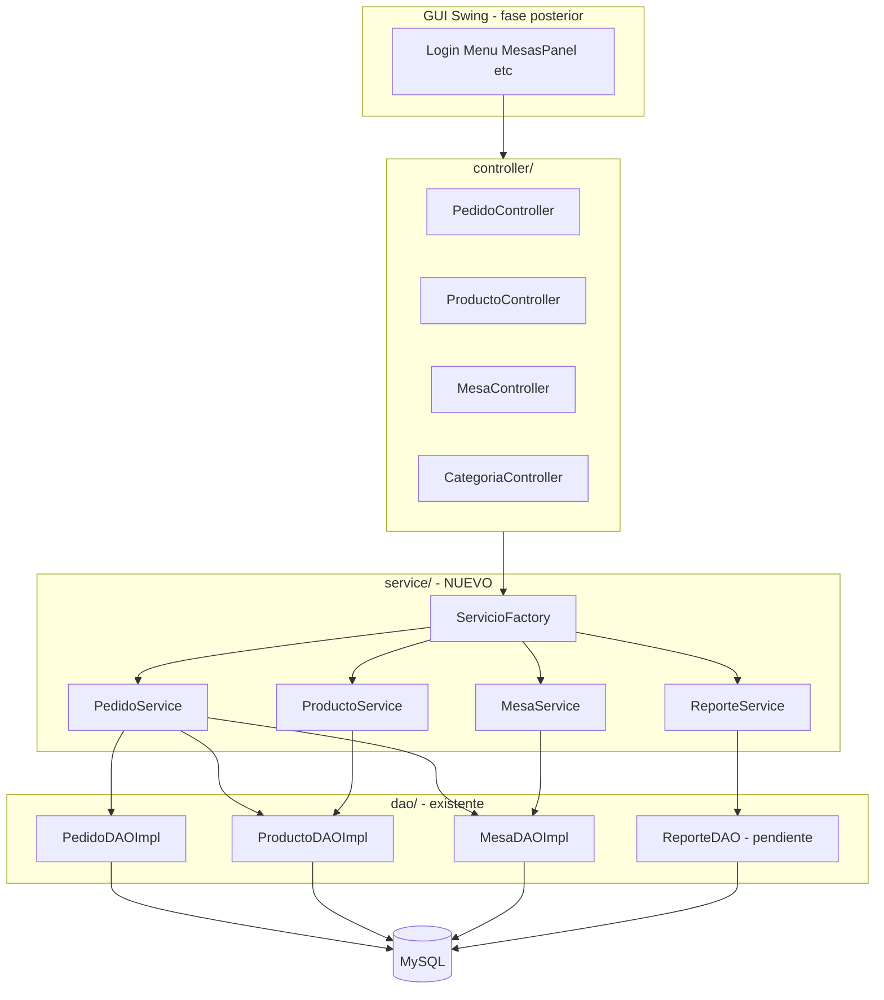
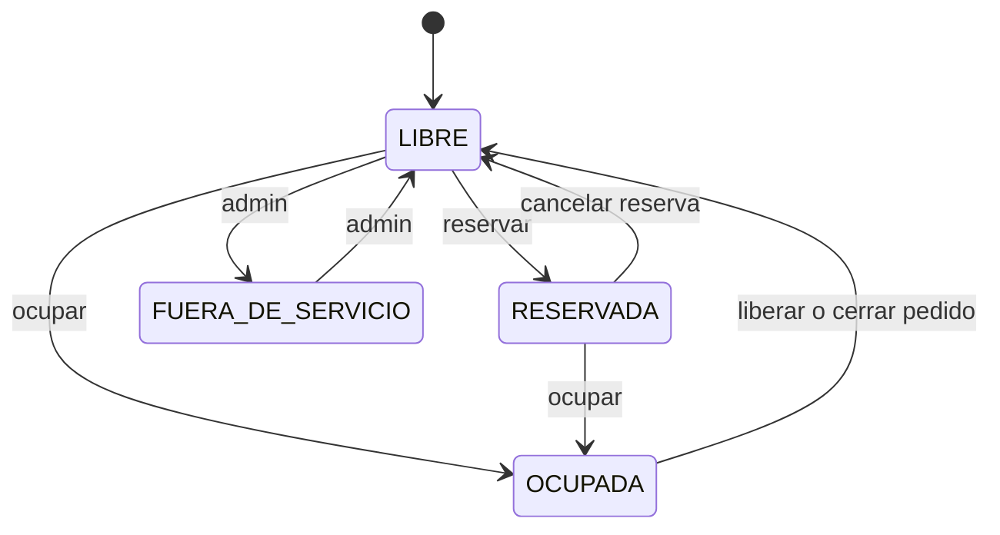
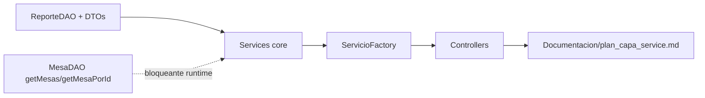

# Plan: Capa Service y Controllers

## Contexto actual

Según [divisionTareasPlan/divisiontareas.html](divisionTareasPlan/divisiontareas.html), el **Integrante 3** debe implementar la lógica de negocio en `service/` y orquestar la conexión con las vistas vía `controller/`. Hoy:

| Componente | Estado |
|---|---|
| Modelos + schema | Completos ([schema.sql](Backend/src/main/resources/schema.sql)) |
| DAOs | Parcial: `ProductoDAOImpl` y `PedidoDAOImpl` avanzados; `MesaDAOImpl` con 3/6 métodos; `CategoriaDAO` vacío; sin `ReporteDAO` ni `UsuarioDAO` |
| `service/` | **No existe** |
| Controllers | Stubs vacíos ([PedidoController.java](Backend/src/main/java/com/restaurant/backend/controller/PedidoController.java), etc.) |
| GUI | Lista con TODOs hacia `ServicioFactory` (conexión en fase posterior) |

**Alcance acordado:** Service + ServicioFactory + Controllers del plan. Autenticación y Reserva quedan fuera de esta iteración.

---

## Arquitectura objetivo



**Regla de capas:** la GUI nunca llama DAOs directamente. Los controllers delegan a services; los services aplican reglas de negocio y llaman DAOs.

---

## Dependencias bloqueantes (coordinar con Integrante 2)

Antes de que los services funcionen en runtime, hay gaps en DAO que el plan documentará como prerequisitos:

1. **[MesaDAOImpl.java](Backend/src/main/java/com/restaurant/backend/dao/MesaDAOImpl.java):** `getMesas()`, `getMesaPorId(int)` lanzan `UnsupportedOperationException` — **críticos** para `MesaService.listar()` y `obtenerPorNumero()`.
2. **Tablas/nombres SQL:** varios DAOs usan `mesa`/`pedido` mientras [schema.sql](Backend/src/main/resources/schema.sql) define `mesas`/`pedidos`. Los services se escribirán contra las interfaces DAO; la corrección SQL es responsabilidad del DAO (bloqueante de integración).
3. **[ProductoDAO.java](Backend/src/main/java/com/restaurant/backend/dao/ProductoDAO.java):** `FiltrarPorCategoria` devuelve un solo `Producto`. `ProductoService.obtenerPorCategoria(String)` filtrará en memoria desde `getProductos()` hasta que el DAO exponga listado por categoría.
4. **`ReporteDAO`:** no existe. Se creará interfaz + impl mínima en esta iteración (consultas a `vw_ventas_por_producto` y `vw_ventas_por_mes`) porque `ReporteService` no puede operar sin ella.

---

## Estructura de archivos a crear

```
Backend/src/main/java/com/restaurant/backend/
├── service/
│   ├── ServicioFactory.java          # Singleton de acceso
│   ├── PedidoService.java
│   ├── ProductoService.java
│   ├── MesaService.java
│   ├── ReporteService.java
│   └── dto/                          # DTOs para reportes (opcional, liviano)
│       ├── VentaPorProductoDTO.java
│       └── VentaPorMesDTO.java
├── dao/
│   ├── ReporteDAO.java               # Nuevo
│   └── ReporteDAOImpl.java           # Nuevo
└── controller/                       # Completar stubs existentes
    ├── PedidoController.java
    ├── ProductoController.java
    ├── MesaController.java
    └── CategoriaController.java
```

---

## Diseño por servicio

### 1. `ServicioFactory`

Punto único de acceso (patrón ya esperado por la GUI en TODOs):

```java
public final class ServicioFactory {
    public static PedidoService getPedidoService() { ... }
    public static ProductoService getProductoService() { ... }
    public static MesaService getMesaService() { ... }
    public static ReporteService getReporteService() { ... }
}
```

- Instancias lazy, reutilizables (sin estado de sesión en el factory).
- Inyecta implementaciones DAO concretas (`new XxxDAOImpl()`), coherente con el estilo actual del proyecto.

### 2. `PedidoService`

**Responsabilidad:** reglas de pedido según [reporte_primera_etapa.md](Documentacion/reporte_primera_etapa.md) y el chip del plan (`calcularTotal`, `cerrarPedido`).

| Método | Lógica de negocio |
|---|---|
| `crearPedido(Mesa, Usuario, List<DetallePedido>)` | Validar mesa `LIBRE` o `RESERVADA`; rechazar `OCUPADA`/`FUERA_DE_SERVICIO`; validar stock por ítem; calcular subtotales y total; persistir vía `PedidoDAO.Insertar`; marcar mesa `OCUPADA` |
| `agregarItem(int pedidoId, Producto, int cantidad)` | Verificar pedido `ABIERTO`; verificar stock; recalcular total |
| `calcularTotal(Pedido)` | Delegar a `Pedido.recalcularTotal()` (ya existe en modelo) |
| `cerrarPedido(int pedidoId)` | Cambiar estado a `CERRADO`; liberar mesa a `LIBRE`; descontar stock vía `ProductoService` |
| `cancelarPedido(int pedidoId)` | Estado `CANCELADO`; liberar mesa |
| `listarPorEstado(EstadoPedido)` | Delegar a DAO |
| `obtenerDetalles(int pedidoId)` | Delegar a DAO |

**Validaciones críticas:**
- Stock suficiente antes de confirmar ítems.
- Descuento de stock al cerrar (no al agregar, para permitir cancelación sin revertir stock parcial).
- Total = suma de subtotales (`precioUnitario * cantidad`).

### 3. `ProductoService`

**Responsabilidad:** validaciones ABM (chip del plan).

| Método | Lógica |
|---|---|
| `obtenerTodos()` | `productoDAO.getProductos()` |
| `obtenerPorCategoria(String)` | Filtrar `getProductos()` por nombre de categoría (case-insensitive) |
| `obtenerPorId(int)` | DAO |
| `crear(Producto)` | Validar nombre, precio >= 0, stock >= 0, categoría obligatoria; delegar `insertar` |
| `actualizar(Producto)` | Mismas validaciones + id > 0 |
| `eliminar(int id)` | Validar id > 0; delegar |
| `descontarStock(int productoId, int cantidad)` | Uso interno desde `PedidoService.cerrarPedido` |

Las validaciones de formato ya existen parcialmente en `ProductoDAOImpl.validarProducto()` — el service las duplica/refuerza a nivel de negocio (precio negativo, producto no disponible, etc.) sin depender del mensaje String del DAO.

### 4. `MesaService`

**Responsabilidad:** asignar y liberar mesa (chip del plan).

| Método | Lógica |
|---|---|
| `listar()` | `mesaDAO.getMesas()` |
| `obtenerPorNumero(int numero)` | Buscar en listado o vía `getMesaPorId` |
| `ocupar(int mesaId)` | Solo si estado `LIBRE` o `RESERVADA` → `OCUPADA` |
| `liberar(int mesaId)` | Solo si no hay pedido activo (`ABIERTO`/`EN_COCINA`/`LISTO`) → `LIBRE` |
| `reservar(int mesaId)` | Solo si `LIBRE` → `RESERVADA` (base para futuro `ReservaService`) |
| `cambiarEstado(int mesaId, EstadoMesa)` | Validación de transiciones permitidas |

**Transiciones permitidas:**



### 5. `ReporteService`

**Responsabilidad:** armar datos para la vista de reportes (Integrante 5).

| Método | Fuente |
|---|---|
| `ventasPorProducto()` | `ReporteDAO` → vista `vw_ventas_por_producto` |
| `ventasPorMes()` | `ReporteDAO` → vista `vw_ventas_por_mes` |
| `resumenGeneral()` | Agregación simple (total pedidos cerrados, suma totales) |

### 6. Controllers

Los controllers **no contienen lógica de negocio**; exponen métodos que la GUI invocará (sin Swing/listeners en esta iteración — los ActionListeners los cableará el frontend después):

| Controller | Delega a | Métodos expuestos |
|---|---|---|
| `PedidoController` | `PedidoService` | `crear`, `cerrar`, `listar`, `obtenerDetalles` |
| `ProductoController` | `ProductoService` | `listar`, `listarPorCategoria`, `crear`, `editar`, `eliminar` |
| `MesaController` | `MesaService` | `listar`, `obtenerPorNumero`, `ocupar`, `liberar` |
| `CategoriaController` | (stub mínimo) | Retorna categorías derivadas de productos hasta que `CategoriaDAO` exista |

Patrón en cada controller:

```java
public class MesaController {
    private final MesaService mesaService = ServicioFactory.getMesaService();
    public List<Mesa> listarMesas() { return mesaService.listar(); }
    // ...
}
```

---

## Documento de cambios (entregable en Documentacion/)

Al ejecutar el plan, se creará **[Documentacion/plan_capa_service.md](Documentacion/plan_capa_service.md)** con:

1. Resumen ejecutivo y diagrama de arquitectura
2. Listado completo de archivos nuevos y modificados
3. Contrato de cada service (firma de métodos + reglas)
4. Contrato de cada controller
5. Dependencias pendientes del DAO (tabla de bloqueantes)
6. Orden de implementación y criterios de aceptación
7. Changelog vivo (misma estructura que [reporte_back_dao.md](Documentacion/reporte_back_dao.md))

---

## Orden de implementación



1. `ReporteDAO` + DTOs (desbloquea `ReporteService`)
2. Services: `ProductoService` → `MesaService` → `PedidoService` → `ReporteService`
3. `ServicioFactory`
4. Controllers (4 clases)
5. Documento en `Documentacion/`
6. Verificación: `mvn compile` en `Backend/`

---

## Criterios de aceptación

- Carpeta `service/` con 5 clases compilables
- Controllers delegan exclusivamente a services (sin SQL)
- Reglas de negocio de pedidos/mesas/stock implementadas en services
- `ServicioFactory` expone los 4 servicios del plan
- `Documentacion/plan_capa_service.md` generado con el inventario completo de cambios
- Proyecto compila con `mvn compile -f Backend/pom.xml`

---

## Fuera de alcance (iteración siguiente)

- `AutenticacionService` + `UsuarioDAO` (Login/Registro)
- `ReservaService` + modelo `Reserva` (GUI lo referencia pero no hay tabla en schema)
- Conexión real GUI ↔ controllers (Integrantes 4 y 5)
- Tests unitarios de services
